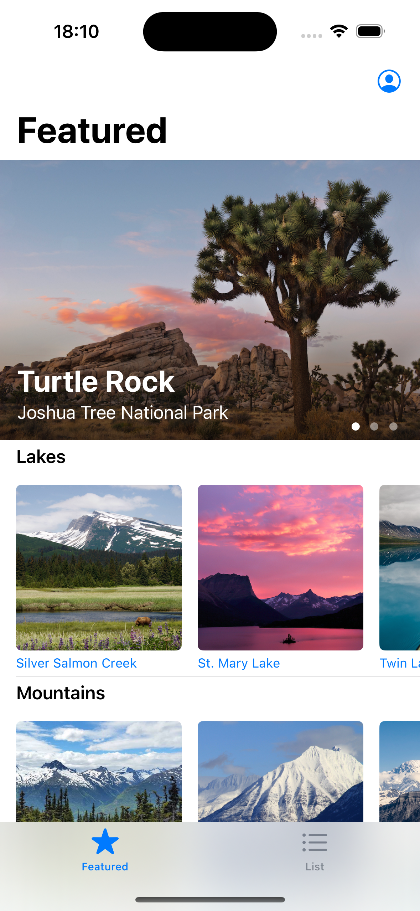
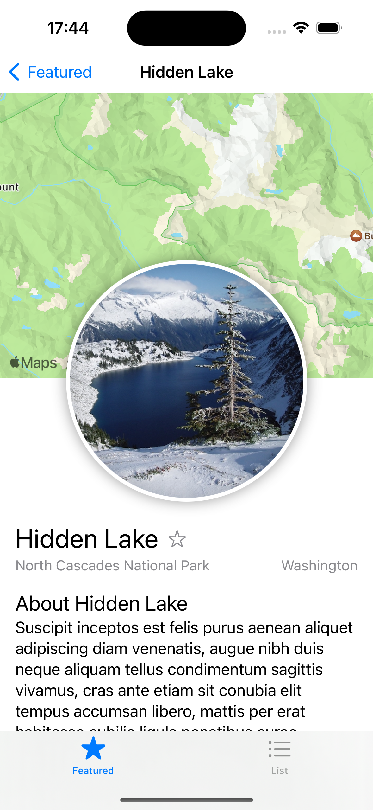
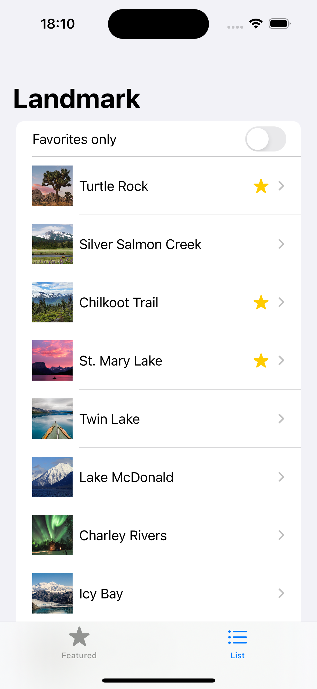

# Landmarks iOS App

## Overview

Landmarks is an iOS application that allows users to view and interact with a list of famous landmarks. Users can browse landmarks, view detailed information about each landmark, and mark their favorites.

## Features

- Browse a list of famous landmarks
- View detailed information about each landmark
- Mark landmarks as favorites
- Search for landmarks
- Map integration to show landmark locations

## Screenshots

<div style="display: flex; flex-wrap: wrap; justify-content: space-around;">
    
    
    
</div>

## Tech Stack

- **Swift**: The programming language used for iOS development.
- **SwiftUI**: Used for building the user interface.
- **Combine**: Used for handling asynchronous events and data binding.
- **MapKit**: Used for map integration to display landmark locations.

## Getting Started

To get a local copy up and running, follow these simple steps.

### Prerequisites

- Xcode 11 or later
- iOS 13.0 or later

### Installation

1. Clone the repository
   ```sh
   git clone https://github.com/your_username/landmarks-ios-app.git
   ```
2. Open the project in Xcode
   ```sh
   cd landmarks-ios-app
   open Landmarks.xcodeproj
   ```
3. Build and run the project on your simulator or connected device

## Usage

- Launch the app on your iOS device or simulator.
- Browse the list of landmarks.
- Tap on any landmark to view detailed information.
- Use the favorite button to mark landmarks you like.
- Use the search functionality to find specific landmarks.


## License

This project is licensed under the MIT License - see the [LICENSE](LICENSE) file for details.

## Acknowledgements

- [Apple Landmarks Tutorial](https://developer.apple.com/tutorials/swiftui/creating-and-combining-views)